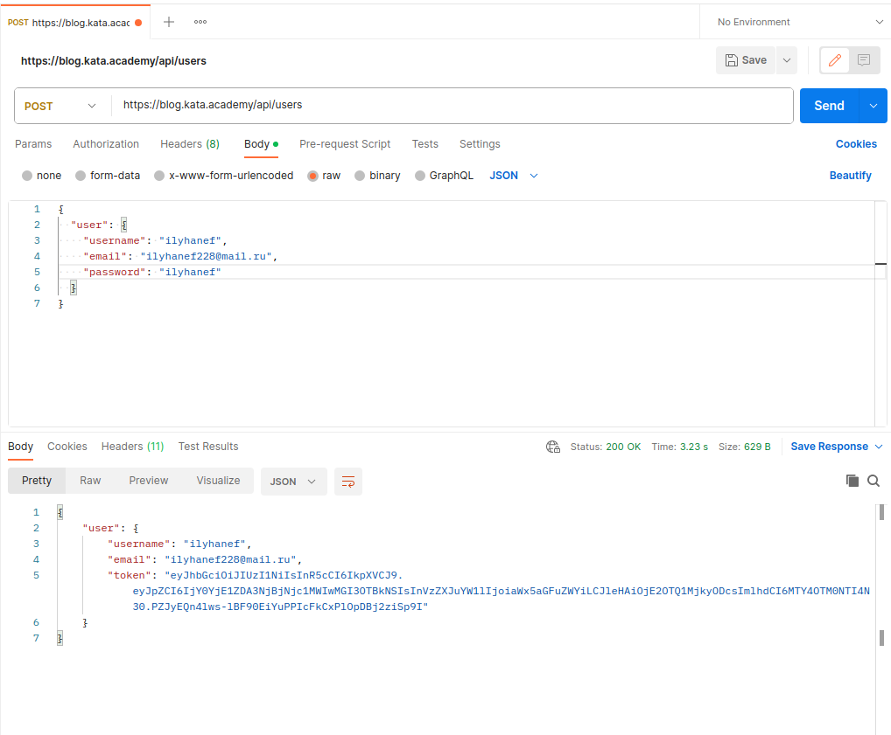
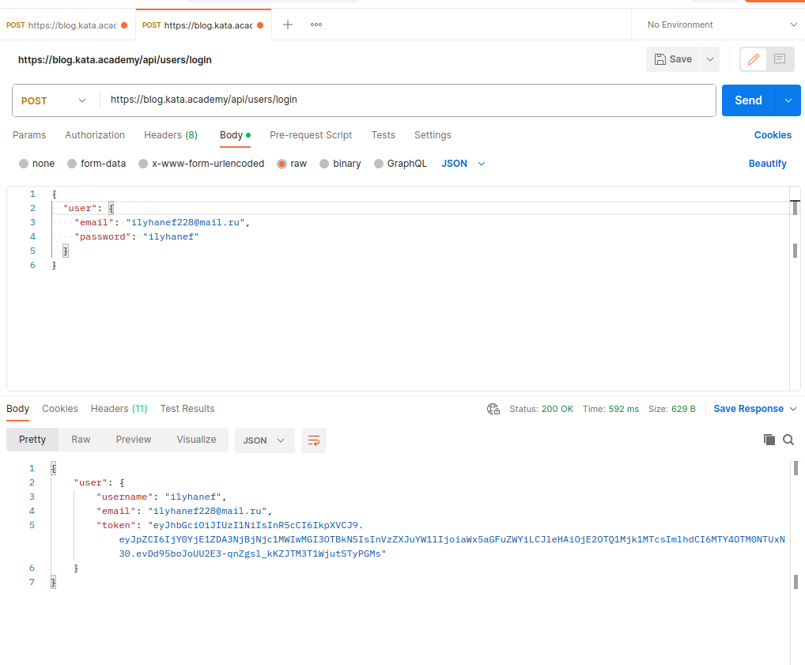
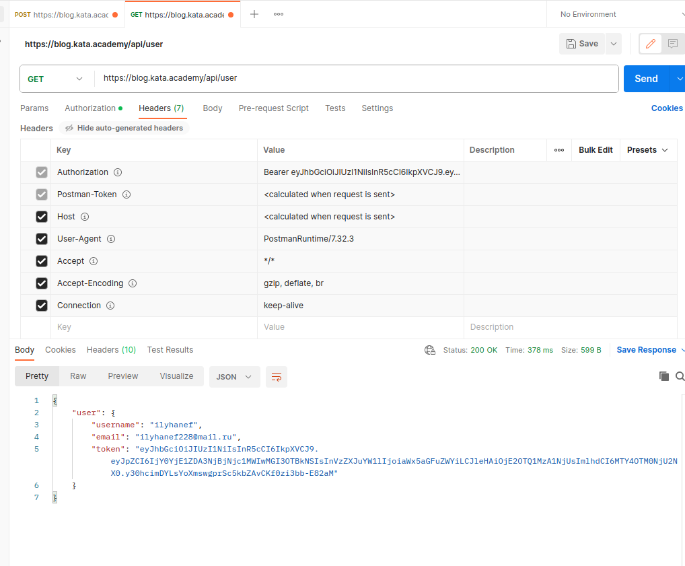

Application for GET GitHub repositories via opening GitHub API.
This application live there: https://ilyha-t.github.io/JScore/

-----------------------------------
using methods:
GET - https://api.github.com/search/repositories?q=${repoName} ; repoName - name searching repository
-----------------------------------

Settings params:
1) getRepos = autocompleteInput(fetchGitRepos, 500), where: 500 - delay in ms between requests to GitHub API.

REST API
-----------------------------------
Registration user Ilyha Nefedev (method POST):

Authorization user (method POST):

Get current user (method GET):
